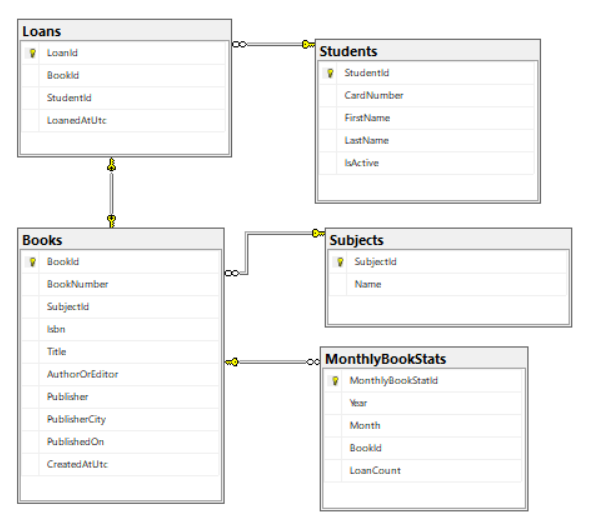

## ASP.NET Core Library System - BSEVITA

#### Die Aufgabenstellung für die 3. Blockwoche des Jahres 2025/26: [Aufgabenstellung.pdf](docs/Aufgabenstellung.pdf)

Bezüglich Setup und bisher unbekannte Keyword hier die Readme Files.

- [Setup](docs/setup.md)   
- [Unknown Keywords](docs/keywords.md)

Das Projekt wurde mit Database first umgesetzt.

## ERD (Entity Relationship Model) Modell

